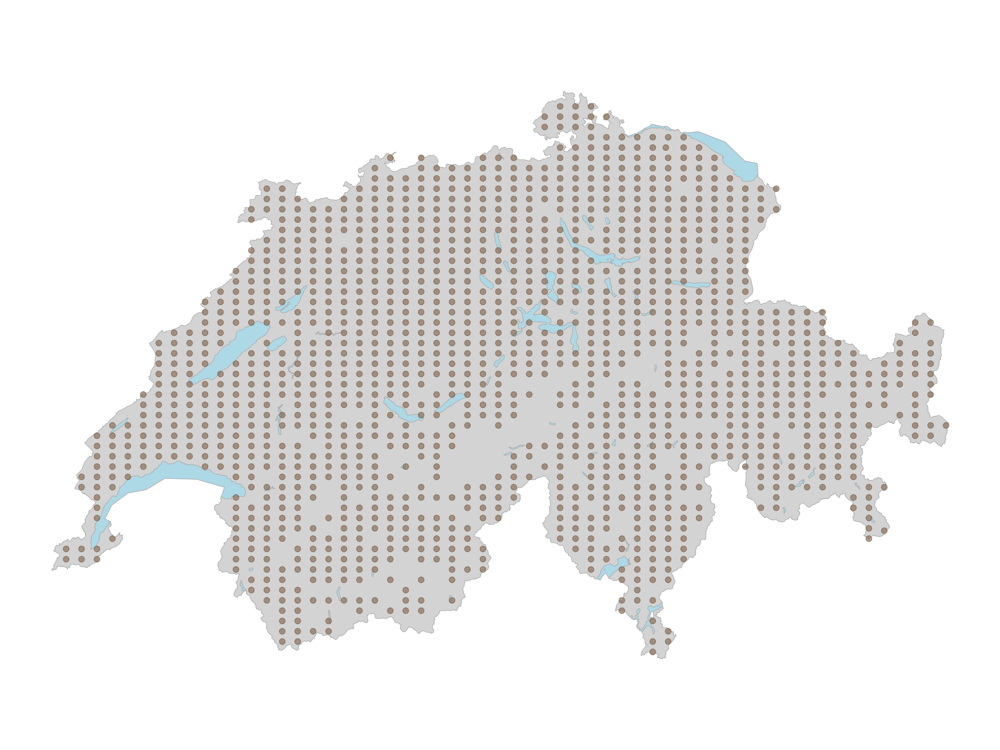
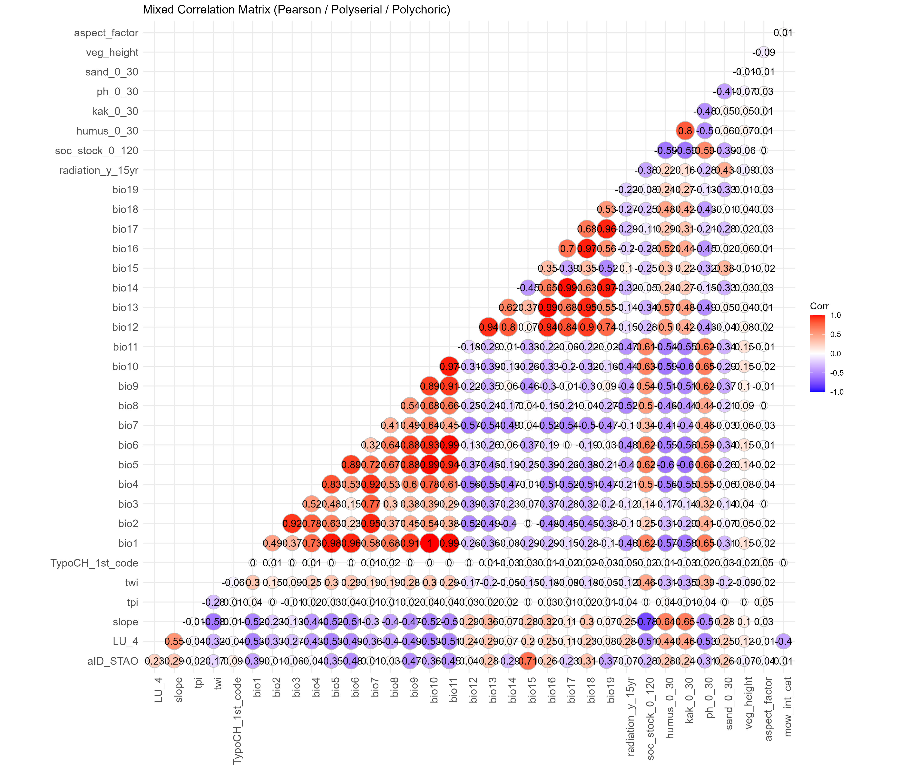
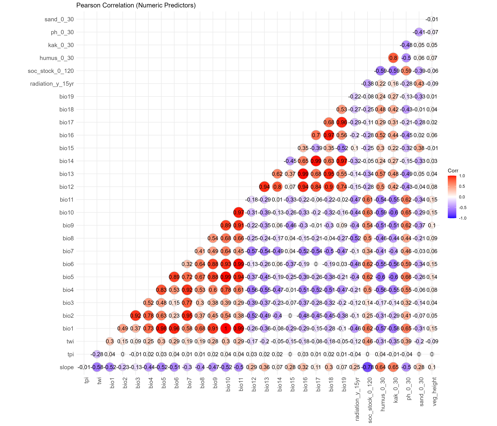
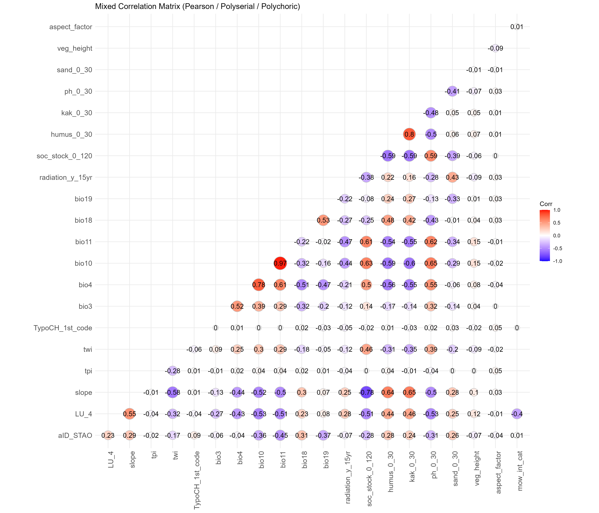
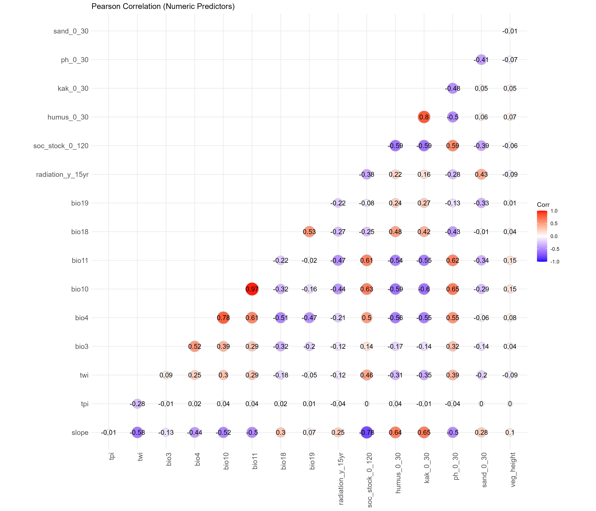
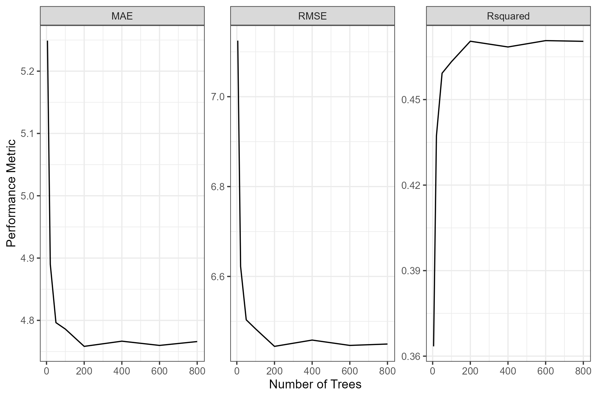
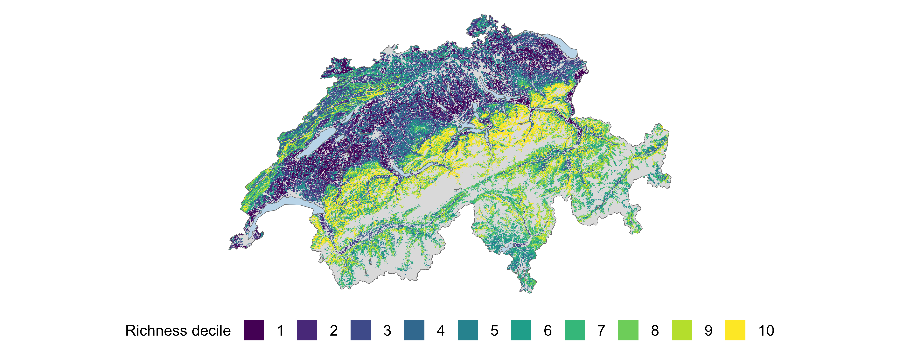
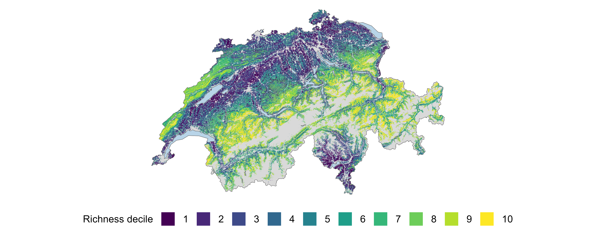
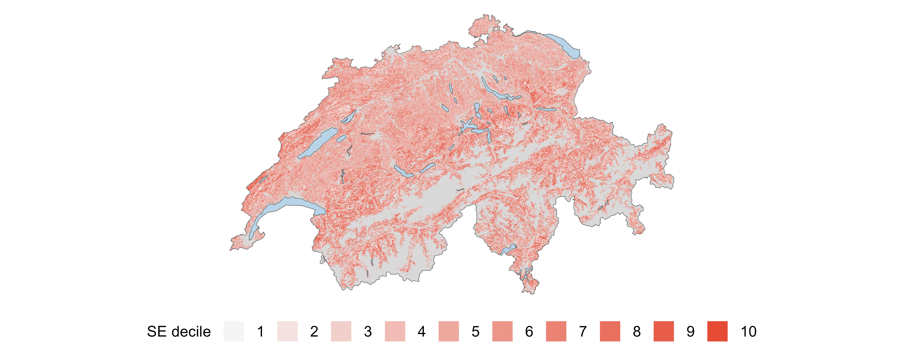
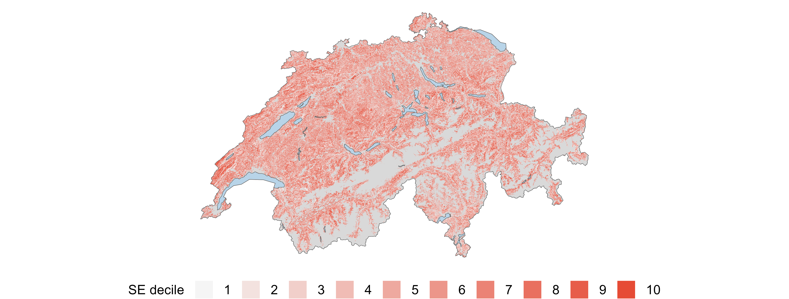

```{r}
#| echo: false
#| message: false
#| warning: false
#| results: "hide"

# Load libraries used throughout the document
library(ggplot2)
library(tidyverse)
```

```{=typst}
// Helper: place content spanning both columns
#let fullwidth(content) = place(auto, scope: "parent", float: true, block(width: 100%, content))

// Sequential figure numbering across all sections
#set figure(numbering: "1")

// Override any show-heading rule that resets the figure counter per section.
// Captures the counter value before the heading is rendered and restores it after,
// so Quarto's per-chapter counter resets are neutralised.
#show heading.where(level: 1): it => context {
  let fig-n = counter(figure).get().at(0)
  it
  v(0.5em)
  counter(figure).update(fig-n)
}

// Table captions at the top
#show figure.where(kind: table): set figure.caption(position: top)

// Smaller font and tighter spacing for all tables
#show figure.where(kind: table): set text(size: 8.5pt)

// Table style - minimal with no borders
#let styled-table = table.with(
  fill: white,
  stroke: none,
  inset: (x: 4pt, y: 2pt),
)
```

# Abstract

\begin{quote}
<!--Intro Sentence-->Biodiversity loss in ecosystems lead to a significant change in functional aspects, which reduces their productivity and resilience. In order to keep ecosystems functioning it is thus crucial to quantify and understand how biodiversity changes across systems. 
<!--Explain species data-->
For this purpose the Swiss Biodiversity Monitoring (BDM) has been gathering valuable data such as the Z9 indicator dataset that measures species richness on a small scale using about 1600 permanent 10 $m^2$ plots spanning a regular grid across the entirety of Switzerland.
<!--Environmental data-->
This species richness data was paired with environmental geodata which was processed to form 20 environmental predictors for climate, topography/soil, vegetation/habitat structure, and land use. 
<!--Modelling-->
Using Random Forest models the relationship between species richness and the environmental predictors was analyzed in a cross-sectional analysis using the latest BDM survey period (2021–2025) as well as a temporal analysis by pairing species richness changes with climatic changes over 2001–2020.
<!--Result-->
The analysis of the cross-sectional data revealed an ensemble of significant environmental predictors for both bryophytes and vascular plants with complementary responses to vegetation height, soil pH and mowing intensity. Vascular plants were less predictable with a lower explained variance of 0.38 in mean Cross-validation R² compared to 0.47 for bryophytes.
The species richness change analysis could not directly link climatic changes to richness changes but did indicate that stronger changes are happening in places with lower temperatures. The explained variance was very low with less than 0.02 in mean Cross-validation R² for both taxonomic groups. 
<!--Conclusion-->
In conclusion the findings show familiar patterns with species richness being a complex phenomenon that depends on many environmental factors with responses to these factors not always being simple and the same between taxonomic groups. Directly linking climatic changes to BDM species richness changes was not successful and requires more careful predictor selection and target definitions.
\end{quote}

# Introduction
<!--
(Biodiversity loss, cardinale 2012)
(Its impact, pecl 2017)
(The importance of species richness modelling, ferrier 2002)
(Conceptually species richness modelling, ferrier and guisan 2006 von steinmann 2009, ist eigentlich eher ein review, aber gut als referenz)
(Predictive Modelling relies on niche theory, austin 2002 von Steinmann 2009, ist eigentlich eher eine rüge)
(More Heterogeneous environments lead to more diversity, stein 2014)
(Interplay between biotic and abiotic, krebs 2014)
(Energy and water availability, currie 1991 hawkins 2003)
(Modelling results in complex response curves, oksanen 2002)
(Swiss Biodiversity Monitoring, weber 2004)
(Prior studies done with BDM data, zellweger 2015, zellweger 2016, viguesjorba 2025...)

(Zimmerman 2000 predictive habitat distribution models nehme ich als kritik und um rechtfertigung für die Nutzung von RF)
-->

<!--Biodiversity and loss-->
Biodiversity loss is one of the most pressing global environmental challenges of our time [@cardinaleBiodiversityLossIts2012b].
<!--Declinig richness and its effects-->
A decline and or redistribution of biodiversity through climatic changes leads to reduction of ecosystem functioning [@peclBiodiversityRedistributionClimate2017a].
<!--Mitigate the crisis and modelling biodiversity-->
To deal with this challenge, it is important to have predictive models of biodiversity patterns and their drivers. They help to understand where species occur and why they are changing across landscapes and thus can inform conservation planning and management decisions to mitigate biodiversity loss [@ferrierMappingSpatialPattern2002].
<!--Species richness, modelling and niche theory-->
Among the many aspects of biodiversity, species richness is a widely modelled metric to quantify and communicate biodiversity patterns. Conceptually it can be modelled at the individual level or at the community level [@ferrierSpatialModellingBiodiversity2006]. The theoretical foundation for predicting species richness relies on niche theory, which suggests that species distribution and communities are driven by individual species and their responses to environmental gradients [@austinSpatialPredictionSpecies2002].
<!--Broad spatial scales and factors influencing species richness-->
At broad spatial scales, these gradients are primarily affected by climate, especially energy and water availability, with diversity typically peaking in warm, moist environments where photosynthetic productivity is highest [@currieEnergyLargeScalePatterns1991; @hawkinsENERGYWATERBROADSCALE2003]. At finer scales, topographic complexity, soil chemistry, disturbance regimes, and land usage by humans interact with the climatic factors to shape local richness patterns with greater heterogeneity generally leading to higher species richness [@steinEnvironmentalHeterogeneityUniversal2014].
<!--Interplay between biotic and abiotic factors and response curves-->
Furthermore, the interplay between biotic and abiotic factors create complex dynamics that must be accounted for in ecological modelling [@krebsEcologyExperimentalAnalysis2014b]. With individuals and communities responding to these environmental gradients along response curves which are often not simple hump-shaped curves but rather more complex due to stressors such as climate change [@oksanenContinuumTheoryRevisited2002].
<!--BDM and its studies-->
Due to the importance of understanding biodiversity patterns and the reliance on high-quality data a Swiss nationwide biodiversity monitoring program (BDM) was established in 2001 to systematically track biodiversity indicators across the country [@weberScaleTrendsSpecies2004]. Several studies have already worked with data from this program to model diversity. @wohlgemuthModellingVascularPlant2008 used the BDM Z7 indicator which is a coarse 1 km² sample network to produce nationwide richness maps for vascular plants. @steinmannModellingPlantSpecies2009 used the finer scale Z9 indicator with its 10 m² permanent plots and modelled plant species richness across Switzerland focusing on non-urban areas. @zellwegerDisentanglingEffectsClimate2015 used a subset of the Z9 plots located in temperate forest environments to understand the contributions of various predictors on species richness within forests for both plants and bryophytes. In a follow-up study @zellwegerEnvironmentalPredictorsSpecies2016 then used the coarser Z7 indicator focusing on forests and plants. Finally and most recently @viguesjorbaDifferentialResponsesTaxonomic2025a examined the response of different taxa and their taxonomic, functional and phylogenetic diversity to environmental factors also within forests.

<!--Research gap-->
Despite the rich and high quality dataset at hand no study was done using all BDM Z9 plots to create a model explaining species richness for bryophytes and vascular plants across Switzerland. A in-depth look at the differences between the two taxonomic groups and their response curves to environmental factors with non-parametric models, such as Random Forests, has not yet been done. Additionally the temporal structure of the dataset has not yet been paired with environmental data to understand species richness change over time and new environmental data now allows for a more up to date analysis. To address these gaps, I want to take a closer look at the following research questions: <br>

<!--Research questions selection-->
(I) Which environmental variables act as the most significant predictors of species richness and how does their explanatory behaviour differ across bryophytes and vascular plants? <br>
(ii) Which environmental factors constitute significantly to species richness changes in recent years and how does their explanatory behaviour differ across bryophytes and vascular plants? 

# Material and Methods
## Study Area
<!--Study Area, same text as in my previous work-->
The study area encompasses the entire country of Switzerland, which is located in Central Europe. Switzerland covers an area of approximately 41'290 $\text{km}^2$ and is characterized by diverse landscapes, including the Swiss Alps, the Swiss Plateau, and the Jura Mountains. The country has a temperate climate with distinct seasons, ranging from cold winters to warm summers. Between 1991 and 2020 the average annual temperature was 5.8 °C. The highest annual precipitation occurs in the Alpine regions with about 2'000mm, while the northern plateau gets between 1'000mm and 1'500mm of annual precipitation [@federalofficeofmeteorologyandclimatologymeteoswissClimateSwitzerlandMeteoSwissn.d]. Switzerland is known for its variety of ecosystems such as forests, grasslands, wetlands, and alpine habitats that support a wide range of plant and animal species [@delarzeLebensraeumeSchweizOekologie2015]. The country's topography varies significantly, with elevations ranging from lowland areas to high mountain peaks, influencing local climate conditions and biodiversity patterns.

## Species Data
<!--Explain species data used, also similar to previous work-->
In my analysis I used the Z9 field data from the Biodiversity Monitoring Switzerland BDM [@weberScaleTrendsSpecies2004] which consist of approximately 1'600 circular 10 $m^2$ permanent plots on land, spread across Switzerland in a regular grid with a spacing of 6km in North South and 4km in East West direction between each plot. The centres of these plots are marked with a magnet buried in the upper surface which allows for precise relocation during each survey. If a magnet could not be buried, a steel pin or colour marker was used instead. These plots were surveyed since 2001 by skilled botanists using a staggered approach, meaning that in each year a fifth of the entire sample plots were surveyed. Thus each plot is surveyed once every five years. This levels off extreme annual fluctuations while still allowing for up-to-date reporting [@bdmcoordinationofficeSwissBiodiversityMonitoring2014a]. I analyzed all of the data points even when no bryophytes and or vascular plant species were found during the survey. Plots which were not accessible due to them being situated on water bodies or in inaccessible alpine regions were already excluded when receiving the data. Across all survey years a total of 1449 unique plots were visited at least once (@fig-spatial-distribution). Using this data the per-plot and year alpha richness was computed separately for both taxonomic groups from the raw BDM survey records. The resulting richness tables contained 7'105 surveys for bryophytes and 7'137 surveys for vascular plants.

```{r}
#| label: fig-spatial-distribution
#| fig-cap: "Spatial distribution of the 10 $m^2$ survey plots on a regular grid across Switzerland."
#| echo: false
#| out-width: "100%"
invisible(file.copy("../08_plotting/plots/plot_locations/plot_locations.png",
          "_figures/plot_locations.png", overwrite = TRUE))

```

## Geodata
### Acquisition
<!--Mention: source, data acquisition, timespan, resolution, coordinate system-->
<!--Climate-->
Monthly minimum and maximum temperature as well as monthly precipitation data were obtained from MeteoSwiss [@StartseiteMeteoSchweiz] covering the period of 1971–2023. They were downloaded at a resolution of 1km and were present as GeoTIFF files in EPSG:2056. Monthly direct solar irradiation layers were additionally obtained from MeteoSwiss as GeoTiff with the same resolution covering the period of 2004–2021 in EPSG:4326.<!--Topography-->
Topographic raw data was obtained from the Federal Office of Topography (swisstopo) in the form of a nationwide elevation Model at 25m resolution downloaded directly from swisstopo [@swisstopo2010dhm25]. The data were downloaded as ASCII grid files in the older Swiss coordinate system EPSG:21781.
<!--Vegetation-Structure/Habitat-->
Habitat data were obtained from EnviDat by the Swiss Federal Institute for Forest, Snow and Landscape Research (WSL) in form of the Swiss habitat map v1_2 2025 [@the-habitat-map-of-switzerland-v1_2-2025], a polygon vector layer in EPSG:2056 classifying habitats into 9 first level and 32 second level classes according to @delarzeLebensraeumeSchweizOekologie2015. A Vegetation height map [@ginzler2021vegetationheightmodelnfi] was obtained from the 2021 national stereo vegetation height model at 2m resolution, downloaded also from EnviDat by WSL as a GeoTIFF in EPSG:2056.
<!--Soil-->
Soil data were obtained from the Kompetenzzentrum Boden (KoBo) national soil service provider [@kobo_bodenportal]. It provides raster layers as GeoTIFFs in EPSG:2056 in 30m resolution for various soil properties. Humus content, cation exchange capacity (KAK), pH, sand fraction, silt fraction, and clay fraction were available in three depth profiles (0–30, 30–60, 60–120 cm), while soil organic carbon stock was available in just one (0-120 cm). 
<!--Land-Use-->
Land use data was obtained from the Swiss Arealstatistik, provided by the Federal Statistical Office [@bfs_geostat_1979_85_arealstatistik], which classifies land cover on a regular point grid across Switzerland at 100m spacing, available in EPSG:2056 as a vector layer. It provides multiple classification levels for different analytical purposes. Additionally a grassland mowing intensity map for the year 2021 was obtained at 10m resolution from WSL [@grassland-use-intensity-maps-for-switzerland-2023]. It was available as a GeoTiff in EPSG:32632 and contained values representing the modelled number of mowing events per year.

```{=typst}
#fullwidth[
  #figure(
    placement: auto,
    table(
      columns: (auto, 1fr, auto, auto, auto),
      stroke: none,
      align: left,
      inset: (x: 4pt, y: 2pt),
      table.header([*Data Type*], [*Variables*], [*Resolution*], [*Acquired Layers*], [*Source*]),
      table.hline(stroke: 0.5pt),
      [Climate], [Monthly minimum and maximum temperature, monthly precipitation], [1 km], [1908], [MeteoSwiss],
      [Climate], [Monthly direct solar irradiation], [1 km], [252], [MeteoSwiss],
      [Topography/Soil], [Digital elevation model ], [25 m], [1], [swisstopo],
      [Topography/Soil], [Humus, pH, KAK, sand, silt, clay (3 depth profiles, 0–30, 30–60, 60–120 cm)], [30 m], [18], [KoBo],
      [Topography/Soil], [Organic carbon stock in 1 depth profile 0–120 cm], [30 m], [1], [KoBo],
      [Vegetation/Habitat], [Habitat classification], [Vector polygons], [1], [WSL],
      [Vegetation/Habitat], [Vegetation height], [2 m], [1], [WSL],
      [Land Use], [Arealstatistik land cover classification containing classes LU\_4, LU\_10 and AS\_4], [Vector points], [1], [FSO],
      [Land Use], [Grassland mowing intensity], [10 m], [1], [WSL],
    ),
    caption: [Raw environmental data sources and number of acquired geodata layers.],
  ) <tbl-raw-data>
]
```

### Geodata Processing
<!--Bioclim calculations, aggregations, packages used, output CRS and Resolution-->
To capture the climatic conditions relevant to each survey year, 19 bioclimatic variables (BIO1–BIO19) were computed using a 30-year sliding window approach with R [@rcoreteamLanguageEnvironmentStatistical2026] and the packages `terra` [@hijmansTerraSpatialData2026] and `dismo` [@hijmansDismoSpeciesDistribution2024]. For each year between 2001 and 2021, the monthly averages over the preceding 30 years were first calculated for the maximum and minimum temperature and the mean precipitation, the bioclimatic variables were then derived from these averages using the `biovars` function from `dismo`. This produces a time series of bioclimatic layers as GeoTIFFs in the original resolution of 1 km. For Radiation the data for a full 30-year window was not available and thus the yearly average over a 15 year window (2004–2021) was computed to derive a single climatic variable representing radiation conditions. Beforehand the data was originally in EPSG:4326 and was reprojected to EPSG:2056 using `terra` prior to averaging and saving as GeoTIFFs also in 1 km resolution. 
<!--Slope-aspect-twi-tpi calculations, packages used, output CRS and Resolution-->
The Digital Elevation Model (DEM) was originally in the older Swiss coordinate system (EPSG:21781) and was reprojected to EPSG:2056 again using `terra`. From the reprojected DEM, the slope, aspect and Topographic Position Index (TPI) were derived keeping the 25m resolution using the `terrain` function, with slope and aspect expressed in degrees. The Topographic Wetness Index (TWI) was computed separately using the R package `whitebox` [@lindsayWhiteboxGATCase2016]. Prior to TWI calculation, artificial flow sinks were removed from the DEM using a least-cost depression breaching algorithm (`wbt_breach_depressions_least_cost`). A slope raster was then temporarly derived from the sink-free DEM and clamped to a minimum of 0.001° to prevent infinite TWI values in flat terrain resulting in false values. The temporary specific catchment area layer was then calculated using the D-Infinity flow accumulation algorithm, and TWI was derived from the catchment area and slope using `wbt_wetness_index`. Only the final TWI layer was saved as GeoTIFFs in the original 25m resolution.
<!--Creation of Arealstatistik layers-->
The gathered land cover classification layer (Arealstatistik) is distributed as a vector point layer where each point represents the centre of a 100 $\times$ 100 m cell. To enable spatial extraction the three classification levels LU\_4, LU\_10, and AS\_4 were each rasterized to a 100 m resolution grid in EPSG:2056 using `rasterize`. A template raster was constructed from the bounding box of the point layer, extended by 50 m (half the cell size) on each side so that the survey points align with cell centres rather than cell edges. Each classification column was then placed into this template individually and saved as a GeoTIFF.
<!--Reprojection of grassland use intensity map-->
The grassland use intensity map was originally provided in EPSG:32632 and was reprojected to EPSG:2056 using `terra` and saved as a GeoTIFF in the original 10m resolution. Due to it being a rather large dataset, the grassland use intensity map was reprojected using a High Performance Computing cluster (HPC) with larger amounts of computing power available.

### Variable extraction
<!--Extraction of per plot environmental variables-->
Static Raster layers including topography, soil, land use, vegetation height, and mowing intensity were extracted at each BDM plot location using `extract`. The per plot habitat type was extracted by overlaying the plot coordinates with the habitat map using `st_intersection` from the sf package [@pebesmaSimpleFeaturesStandardized2018a]. The bioclimatic variables were extracted separately by extracting the per plot and year values from the GeoTIFFs, resulting in a long-format panel with one row per plot times the end years covering 2001–2021.

### Post-extraction processing
Ranger's Importance p-values method used later in the analysis required that all predictor variables to be without any missing values. This meant I had to deal with missing values which were present in the KoBo soil, vegetation height, and mowing intensity rasters. 
<!--imputation of soil extractions-->
KoBo soil rasters did not provide complete national coverage because the maps are built from exposed soil pixels only [@stumpfSpatiotemporalLandUse2018]. Thus for about a fifth of the plots, which are located in urban sealed areas or in mountainous regions, no valid raster values were extractable. For these plots, missing values were gap-filled by assigning the value of the nearest valid raster pixel. This imputation of missing values was preferred over leaving them as "Not-a-Number" (`NaN`) or imputing them with the mean or median of the raster layer as I assumed that the nearest valid pixel is more likely to represent the local soil conditions of the plot. The gap-filling procedure was implemented using an expanding search radius until a valid pixel was found, allowing for the imputation of missing values using `nearest`.
<!--Setting Vegetation height to 0 where NaN-->
The vegetation height raster contained `NaN` values in areas which were not computed. These `NaN` values were set to zero to represent the absence of vegetation height in these locations. The assumption here being that  the `NaN` values were not due to data errors but rather reflected true zero vegetation height, such as in rocky terrain or low grassland areas.
<!--Setting mowing intensity to to 0 where NaN-->
Similarly with mowing intensity, simply imputing missing values with often used mean would most likely skew the interpretation. Thus Mowing intensity `NaN` values, indicating locations outside the grassland mask, were also set to zero to represent no mowing events.
<!--Factorising mowing intensity-->
Mowing intensity was then binned into four categories (No Mowing, Low, Medium, High) based on the number of mowing events per year. No-Mowing was defined as 0 events per year, Low as 1–2 events, Medium as 3–4 events, and High as 5 or more events.
<!--Factorising aspect-->
Aspect was discretised as well, into eight cardinal directions (N, NE, E, SE, S, SW, W, NW). This was done after calculating the aspect raster from the DEM. The resulting categorical variables were then converted to factors.


## Dataset Construction
### Species Richness Cross-sectional Dataset

For the cross-sectional dataset only the latest survey period was used (2021–2025), meaning that only the most recent survey records for each plot were retained. This resulted in 1'435 bryophyte and 1'442 vascular plant plots with valid richness values. These were then joined with the extracted environmental per plot values by plot ID. The result were two datasets with one row per plot, one column for species richness and 68 columns for the environmental predictors. Because the dimensionality was way to high for the number of observations, a variable selection process was carried out to reduce the number of predictors. Firstly only the first level of the TypoCH habitat classification was retained (9 habitat types) since the second level (32 habitat types) was assumed to be to detailed. Then the Land use classification with 10 classes was dropped in favour of the 4-class classification (1=urban area, 2=agricultural area, 3=forest, 4=unproductive). The aspect layer could be dropped as this was turned into a factor and so could the mowing intensity. The elevation was not included as it was assumed to be very strongly correlated with the bioclimatic variables and would mask their effects. Then only the top level of the soil variables was retained (0–30 cm) as @goebesStrengthSoilplantInteractions2019 have shown that it leads to the best predictive performance of richness. The silt and clay fractions were dropped as they are dependent on the sand fraction. Similarly to @zellwegerEnvironmentalPredictorsSpecies2016, @wohlgemuthModellingVascularPlant2008 and @ellerbrokDeterminantsTerrestrialLimnic2026 I tried to choose bioclimatic variables representing the most ecologically relevant aspects of temperature and precipitation. Meaning that the focus was on temperature and precipitation during the coldest and warmest quarters of the year, as well as temperature seasonality and isothermality. Thus only bioclimatic variables BIO3, BIO4, BIO10, BIO11, BIO18, and BIO19 were retained while the other 13 bioclimatic variables were dropped. All this reduced the number of predictors from 68 to 20. A mixed correlation matrix using pearson for continues variables, polyserial correlation for continuous–ordinal pairs, and polychoric correlation for ordinal–ordinal pairs was computed using `hetcor` from the package `polycor` [@foxPolycorPolychoricPolyserial2025] to check for collinearity among the remaining predictors. The correlation matrix constructed with the remaining predictors (Appendix)<!--Appendix--> revealed still some strong correlation between the bioclimatic variables. According to @boothCheckingBioclimaticVariables2022 this was deemed fine and thus the final set of 20 predictors entering the model for the cross-sectional attempt is summarized in `@tbl-predictors`{=typst}. 

```{=typst}
#fullwidth[
  #figure(
    placement: auto,
    table(
      columns: (auto, 1fr, auto),
      stroke: none,
      align: left,
      inset: (x: 4pt, y: 2pt),
      table.header([*Variable*], [*Description*], [*Type*]),
      table.hline(stroke: 0.8pt),
      table.cell(colspan: 3)[#text(size: 8pt)[Climate]],
      [#h(8pt)`bio3`], [Isothermality (BIO3), BIO2 / BIO7 × 100], [Numeric],
      [#h(8pt)`bio4`], [Temperature seasonality (BIO4), standard deviation × 100], [Numeric],
      [#h(8pt)`bio10`], [Mean temperature of the warmest quarter (°C)], [Numeric],
      [#h(8pt)`bio11`], [Mean temperature of the coldest quarter (°C)], [Numeric],
      [#h(8pt)`bio18`], [Precipitation of the warmest quarter (mm)], [Numeric],
      [#h(8pt)`bio19`], [Precipitation of the coldest quarter (mm)], [Numeric],
      [#h(8pt)`radiation_y_15yr`], [Mean annual direct solar irradiation, 15-year average], [Numeric],
      table.cell(colspan: 3)[#text(size: 8pt)[Vegetation/Habitat]],
      [#h(8pt)`veg_height`], [Vegetation height, 2021 stereo model (m)], [Numeric],
      [#h(8pt)`TypoCH_1st_code`], [First-level habitat type code (TypoCH)], [Factor],
      table.cell(colspan: 3)[#text(size: 8pt)[Topography/Soil]],
      [#h(8pt)`aspect_factor`], [Slope aspect as 8 direction factors (N, NE, E, SE, S, SW, W, NW)], [Factor],
      [#h(8pt)`slope`], [Terrain slope (°)], [Numeric],
      [#h(8pt)`tpi`], [Topographic Position Index], [Numeric],
      [#h(8pt)`twi`], [Topographic Wetness Index], [Numeric],
      [#h(8pt)`soc_stock_0_120`], [Soil organic carbon stock, 0–120 cm (t ha⁻¹)], [Numeric],
      [#h(8pt)`humus_0_30`], [Humus content, 0–30 cm (%)], [Numeric],
      [#h(8pt)`kak_0_30`], [Cation exchange capacity, 0–30 cm (cmol#sub[c] kg⁻¹)], [Numeric],
      [#h(8pt)`ph_0_30`], [Soil pH, 0–30 cm], [Numeric],
      [#h(8pt)`sand_0_30`], [Sand fraction, 0–30 cm (%)], [Numeric],
      table.cell(colspan: 3)[#text(size: 8pt)[Land Use]],
      [#h(8pt)`LU_4`], [Land use class (4-level Arealstatistik classification)], [Factor],
      [#h(8pt)`mow_int_cat`], [Grassland mowing intensity category (No Mowing, Low, Medium, High)], [Factor],
    ),
    caption: [Final set of 20 environmental predictors used in the cross-sectional richness models. The four factor variables enter the Random Forest as unordered categorical predictors.],
  ) <tbl-predictors>
]
```

### Species Richness Change Dataset

Based on the variables selected in the cross-sectional dataset a second dataset was constructed to quantify temporal change at each plot.<!--What I did--> For each plot with at least three survey records within the 2001–2020 survey window, a simple linear regression of species richness against survey year was fitted. The latest survey period was not included in this analysis because MeteoSwiss and thus bioclimatic data for the 2021–2025 survey period was not fully available.<!--The target measure--> The slope coefficient (species / year) was the target measure of the rate of richness change.<!--Deriving Bioclim--> Then for the same period the bioclimatic trends were derived from the 21-year bioclimatic panel data. For each of the six retained bioclimatic variables, a per-plot linear regression over 2001–2020 was computed as the rate of climatic change. Additionally, the 2001 bioclimatic snapshot was extracted as a baseline capturing the starting climate conditions at each plot. The change modelling dataset was then assembled by joining the linear regression fitted richness changes, the six bioclimatic changes, the six bioclimatic baselines, and the 14 remaining static environmental predictors (I.e., the full 20-predictor set with the six bioclimatic normals replaced by their trends and baselines) resulting in a total of 26 predictors `@tbl-predictors-change`{=typst} <!--Dataset size-->with 1'433 valid bryophyte and 1'437 vascular plant plots.

```{=typst}
#fullwidth[
  #figure(
    placement: auto,
    table(
      columns: (auto, 1fr, auto),
      stroke: none,
      align: left,
      inset: (x: 4pt, y: 2pt),
      table.header([*Variable*], [*Description*], [*Type*]),
      table.hline(stroke: 0.8pt),
      table.cell(colspan: 3)[#text(size: 8pt)[Climate — Static]],
      [#h(8pt)`radiation_y_15yr`], [Mean annual direct solar irradiation, 15-year average], [Numeric],
      table.cell(colspan: 3)[#text(size: 8pt)[Climate — Baseline (2001)]],
      [#h(8pt)`bio3_baseline`], [Isothermality (BIO3) at 2001 baseline, BIO2 / BIO7 × 100], [Numeric],
      [#h(8pt)`bio4_baseline`], [Temperature seasonality (BIO4) at 2001 baseline, standard deviation × 100], [Numeric],
      [#h(8pt)`bio10_baseline`], [Mean temperature of the warmest quarter at 2001 baseline (°C)], [Numeric],
      [#h(8pt)`bio11_baseline`], [Mean temperature of the coldest quarter at 2001 baseline (°C)], [Numeric],
      [#h(8pt)`bio18_baseline`], [Precipitation of the warmest quarter at 2001 baseline (mm)], [Numeric],
      [#h(8pt)`bio19_baseline`], [Precipitation of the coldest quarter at 2001 baseline (mm)], [Numeric],
      table.cell(colspan: 3)[#text(size: 8pt)[Climate — Trend (2001–2020)]],
      [#h(8pt)`bio3_slope`], [Isothermality (BIO3) linear trend 2001–2020, BIO2 / BIO7 × 100], [Numeric],
      [#h(8pt)`bio4_slope`], [Temperature seasonality (BIO4) linear trend 2001–2020, standard deviation × 100], [Numeric],
      [#h(8pt)`bio10_slope`], [Mean temperature of the warmest quarter trend 2001–2020 (°C yr⁻¹)], [Numeric],
      [#h(8pt)`bio11_slope`], [Mean temperature of the coldest quarter trend 2001–2020 (°C yr⁻¹)], [Numeric],
      [#h(8pt)`bio18_slope`], [Precipitation of the warmest quarter trend 2001–2020 (mm yr⁻¹)], [Numeric],
      [#h(8pt)`bio19_slope`], [Precipitation of the coldest quarter trend 2001–2020 (mm yr⁻¹)], [Numeric],
      table.cell(colspan: 3)[#text(size: 8pt)[Vegetation/Habitat]],
      [#h(8pt)`veg_height`], [Vegetation height, 2021 stereo model (m)], [Numeric],
      [#h(8pt)`TypoCH_1st_code`], [First-level habitat type code (TypoCH)], [Factor],
      table.cell(colspan: 3)[#text(size: 8pt)[Topography/Soil]],
      [#h(8pt)`aspect_factor`], [Slope aspect as 8 direction factors (N, NE, E, SE, S, SW, W, NW)], [Factor],
      [#h(8pt)`slope`], [Terrain slope (°)], [Numeric],
      [#h(8pt)`tpi`], [Topographic Position Index], [Numeric],
      [#h(8pt)`twi`], [Topographic Wetness Index], [Numeric],
      [#h(8pt)`soc_stock_0_120`], [Soil organic carbon stock, 0–120 cm (t ha⁻¹)], [Numeric],
      [#h(8pt)`humus_0_30`], [Humus content, 0–30 cm (%)], [Numeric],
      [#h(8pt)`kak_0_30`], [Cation exchange capacity, 0–30 cm (cmol#sub[c] kg⁻¹)], [Numeric],
      [#h(8pt)`ph_0_30`], [Soil pH, 0–30 cm], [Numeric],
      [#h(8pt)`sand_0_30`], [Sand fraction, 0–30 cm (%)], [Numeric],
      table.cell(colspan: 3)[#text(size: 8pt)[Land Use]],
      [#h(8pt)`LU_4`], [Land use class (4-level Arealstatistik classification)], [Factor],
      [#h(8pt)`mow_int_cat`], [Grassland mowing intensity category (No Mowing, Low, Medium, High)], [Factor],
    ),
    caption: [Final set of 26 environmental predictors used in the richness change models. The six bioclimatic normals from the cross-sectional model are replaced by their 2001 baseline values and linear trends over 2001–2020.],
  ) <tbl-predictors-change>
]
```

## Modelling Approach

For modelling species richness and species richness change, I used Random Forests (RF) implemented in the R package `ranger` [@wrightRangerFastImplementation2017]. RF is a non-parametric ensemble learning method that constructs multiple decision trees during training and outputs the mean prediction of the individual trees. It is robust to collinearity among predictors, less prone to overfitting and can handle high-dimensional data.<!--Hyperparameter Search--> To find suitable hyperparameters for the RF models, a Cross validation on the entire dataset was performed like @zellwegerDisentanglingEffectsClimate2015 did, since the in Machine-Learning often used train-test split was not applicable because the dataset was small and the initial random train-split mainly determined the model performance. This was implemented using the the R package `caret` [@kuhnBuildingPredictiveModels2008a] with the `ranger` method. The hyperparameters tuned included the number of variables randomly sampled as candidates at each split (`mtry`), the minimum node size (`min.node.size`).<!--Selecting Hyperparameters--> The resulting hyperparameter combination revealed almost no deviations and thus for simplicity in all models rangers default values of mtry equalling the rounded down square root of the number of predictors and minimum node size of 3 were used. Using these hyperparameters the first constructed bryophyte richness model was checked for stability in regards of the number of trees chosen and based on this 500 trees seemed stable and was chosen for all other models (Appendix).<!--Fit models per Taxon group and dataset--> The final RF models were then fitted using `ranger` with the selected hyperparameters and 500 trees. The same modelling approach was applied separately for bryophytes and vascular plants, as well as for species richness and species richness change, resulting in a total of four RF models.<!--Understanding RF-->
Afterwards the models were interpreted using the variable importance measure based on permutation importance and partial dependence plots for the top predictors.<!--Variable Importance--> The variable importance was computed using the `importance_pvalues` function from `ranger`, which provides p-values for the importance scores based on 100 permutation tests.<!--Partial DP--> The partial dependence plots were generated using the `partialPlot` function from the R package `pdp` [@greenwellPdpPackageConstructing2017], which shows the marginal effect of a predictor on the response variable while averaging out the effects of other predictors.<!--Extrapolation and predicting using RF--> To produce spatially continuous richness maps for the entirety of Switzerland, the finalised RF richness models for bryophytes and vascular plants richness were applied to a initialized national raster grid at 100 m resolution in EPSG:2056 based on the arealstatistik LU\_4 raster. Before assembling the raster stack, the habitat type vector layer was rasterized to 10 m resolution in a separate file. Afterwards a shared predictor stack of all 20 variables was assembled by loading each source raster and resampling it to the grid using `resample`. Continuous predictors were resampled with bilinear interpolation and categorical predictors (habitat type, land-use class) were resampled using nearest-neighbour assignment to preserve their integer codes. Using the same rules as in training the missing values in the vegetation height and mowing intensity rasters were set to zero and the mowing intensity and aspect were binned into categories. The final raster stack was then passed to the RF models to predict species richness for each pixel using `predict` and to compute the standard error of the predictions via the infinitesimal jackknife estimator saving 2 GeoTIFF's for each taxonomic group [@wagerConfidenceIntervalsRandom2014]. Only the soil layers were restricting the prediction extent, as they did not cover the entire country. <!--Extrapolation on HPC MENTION--> Due to large files sizes and computational power needed this step was also done on a HPC cluster.

# Results
#### Models of species richness
<!--Moss CV: 
#           metric      mean         sd
# RMSE         RMSE 6.4478985 0.35236466
# Rsquared Rsquared 0.4705521 0.03723306
# MAE           MAE 4.7641125 0.20857580-->
<!--Moss OOB:
# OOB prediction error (MSE):       41.20176 
# R squared (OOB):                  0.4702841-->
<!--Vascular CV:
#           metric       mean         sd
# RMSE         RMSE 12.0593867 0.37903048
# Rsquared Rsquared  0.3772731 0.03807211
# MAE           MAE  9.6728532 0.31332123
-->
<!--Vascular OOB:
# OOB prediction error (MSE):       146.8082 
# R squared (OOB):                  0.3636318 
-->
<!--Cross-Sectional dataset explaiend-->
In the cross-sectional dataset during the latest survey period (2021–2025) the average bryophyte species richness across all plots was 9.9 species per 10 $m^2$ (SD = 8.8, range = 0–46), while the mean vascular plant species richness was 23.6 species per 10 $m^2$ (SD = 15.2, range = 0–77).<!--CV Results--> During hyperparameter tuning the result on the test set was highly dependent on the random train-test split, thus as mentioned in the materials and methods section a Cross-validation on the entire dataset was performed. Plant species were less predictable than bryophyte species with a CV mean explained variance (R²) of 0.38 for vascular plants and 0.47 for bryophytes, and standard deviation of 0.04 for both vascular plants and bryophytes. This meant that the prediction performance of the models could vary up to 8 percentage points depending on the random split performed. Also during Cross-validation the mean absolute error (MAE) was 9.7 for vascular plants and 4.8 for bryophytes. Meaning on average the species richness predictions were off by about 10 species for vascular plants and 5 species for bryophytes.<!--Final model Results--> Out of Bag (OOB) Root mean squared error (RMSE) on the final models fitted on the entire dataset was 12.1 for vascular plants and 6.4 for bryophytes, OOB R² of the final RF model was similar to the CV results with an R² of 0.47 for bryophytes and 0.36 for vascular plants.

<!--Importance of predictors-->
The most important predictor of bryophyte and plant species richness were the 4 Land use classes (LU\_4) by the Arealstatistik (`@fig-imp-richness-combined`{=typst}). It was able to explain a large portion of the variance in species richness for both groups, with a percentage decrease in explained variance of 17% for vascular plants and 77% for bryophytes when left out during permutation.<!--Present in both--> The temperatures in the warmest and coldest quarters, the slope, the mowing intensity and the vegetation height were also among the most important predictors for both groups.<!--Differences--> The only difference in the top predictors between the two groups was that for bryophytes the soil organic carbon, the pH value and the solar radiation was also amongst the most important predictors.

<!--Partial dependence plots continues-->
Partial dependence plots for the significant continuous predictors of bryophyte and plant species richness reveal<!--Bell curve Temp.--> approximately a bell curve as response for the mean temperature of the warmest quarter (BIO10) and mean temperature of the coldest quarter (BIO11) for both groups (`@fig-pdp-richness-continuous`{=typst}).<!--Veg. height--> Vegetation height revealed a decrease in plant richness with increasing vegetation height whilst for bryophytes the relationship was exactly the opposite. It is to be noted that an artefact from setting the vegetation height `NaN` values to zero is visible as a spike in the plot at zero vegetation height.<!--Slope--> The slope appears as a important predictor for both groups with a positive relationship for both.<!--Soil Organic Carbon--> Soil organic carbon content (SOC) shows a rapid decline in richness with increasing SOC for bryophytes and a similar response for vascular plants despite not being significant.<!--pH Moss--> Finally, soil pH shows a negative relationship with bryophyte richness whilst vascular plants show the opposite pattern.
<!--Partial dependence plots factorial-->
For the factorial predictors, the partial dependence plots show that for vascular plants the highest species richness could be found amongst agricultural land followed by urban areas whilst for bryophytes the highest species richness was found in forests followed by unproductive areas (`@fig-pdp-richness-factor`{=typst}).<!--Mowing intensity--> For mowing intensity it can be seen that plant richness increases with increasing mowing intensity, whilst bryophytes show the opposite pattern.<!--Aspect--> Finally in the Aspect partial dependency once again a contrasting pattern between the two groups could be observed with bryophytes showing the highest richness on south-facing slopes and vascular plants showing the highest richness on north-facing slopes.

```{=typst}
#fullwidth[
  #figure(
    placement: auto,
    scope: "parent",
    image("_figures/combined_importance_richness_barplot.png", width: 100%),
    caption: [Variable importance scores as the percentage decrease in explained variance for the most important and significant (p\<0.05) predictors of bryophyte (top) and plant (bottom) species richness colored according to their group.],
  ) <fig-imp-richness-combined>
  #figure(
    placement: auto,
    scope: "parent",
    image("_figures/combined_richness_pdp.png", width: 100%),
    caption: [Partial dependence plots to compare continuous predictors of bryophyte and plant species richness. Significant (p\<0.05) predictors are shown as solid lines with insignificant ones as dashed lines. The initial spike at zero vegetation height is an artefact from setting the `NaN` values to zero during data processing.],
  ) <fig-pdp-richness-continuous>
]
```

```{=typst}
#figure(
  placement: top,
  scope: "column",
  image("_figures/combined_richness_factor_pdp.png", width: 100%),
  caption: [Partial dependence for factorial species richness predictors. Insignificant (p\<0.05) ones are shown as diagonal hatching. Dependencies have been mean centered. LU 4 code 1 is urban, 2 is agricultural, 3 is forest and 4 is unproductive.],
) <fig-pdp-richness-factor>
```

<!--Extrapolation and Prediction maps-->
The created extrapolated species richness maps for bryophytes and vascular plants show some clear distribution patterns (`@fig-spatial-prediction-combined`{=typst}) with higher species richness occurring in pre-alpine regions whilst in the central plateau the richness is lower. The estimated prediction uncertainty maps reveal an overall evenly distributed modelling uncertainty across the country with some higher uncertainty in local patches found in the Jura region and in between the central plateau and the alpine regions (`@fig-spatial-prediction-combined-se`{=typst}).

```{=typst}
#fullwidth[
  #figure(
    placement: auto,
    scope: "parent",
    image("_figures/prediction_combined_100m_viridis.png", width: 100%),
    caption: [Applied RF model predicting bryophyte (left) and plant (right) species richness at 100m resolution. Predictions in darker blue/purple colours indicate lower predicted richness. Not predicted areas due to missing KoBo soil coverage are shown in grey.],
  ) <fig-spatial-prediction-combined>
  #figure(
    placement: auto,
    scope: "parent",
    image("_figures/prediction_combined_se_100m.png", width: 100%),
    caption: [Applied RF model estimating bryophyte (left) and plant (right) species richness error using the oob jackknife estimator at 100m resolution. Not predicted areas due to missing KoBo soil coverage are shown in grey.],
  ) <fig-spatial-prediction-combined-se>
]
```

```{=typst}
#pagebreak()
```

#### Models of Species Richness Change
<!--Vascular CV:
#           metric       mean         sd
# RMSE         RMSE 0.55012252 0.03740239
# Rsquared Rsquared 0.01322408 0.01107169
# MAE           MAE 0.38405819 0.01848813
-->
<!--Vascular OOB:
# OOB prediction error (MSE):       0.3067242 
# R squared (OOB):                  -0.009079647 
-->
<!--Moss CV:
#           metric       mean         sd
# RMSE         RMSE 0.30365987 0.019473718
# Rsquared Rsquared 0.02105203 0.013603134
# MAE           MAE 0.21280288 0.008145288
-->
<!--Moss OOB:
# OOB prediction error (MSE):       0.09278523 
# R squared (OOB):                  0.008097786 
-->
<!--Species richness change dataset explained-->
In the species richness change dataset, the average change of bryophyte richness change was 0.06 species per year and plot (SD = 0.31, range = -2.03 to 1.94), with vascular plants having the same mean change of 0.06 species per year and plot (SD = 0.55, range = -3.74 to 3.72).<!--CV Results--> The richness change models showed near-zero predictive performance. Cross-validation revealed a mean R² of 0.01 for vascular plants and 0.02 for bryophytes, with standard deviations of 0.01 and 0.01 respectively. The mean absolute error (MAE) was 0.38 species per year for vascular plants and 0.21 species per year for bryophytes, meaning that on average the predicted rate of richness change was off by roughly 0.4 species per year for vascular plants and 0.2 species per year for bryophytes.<!--Final model Results--> The OOB R² of the final models confirmed the poor fit, with values of −0.01 for vascular plants and 0.01 for bryophytes.

```{=typst}
#fullwidth[
  #figure(
    placement: none,
    image("_figures/combined_importance_change_barplot.png", width: 100%),
    caption: [Variable importance scores as the percentage decrease in explained variance for the most important and significant (p\<0.05) predictors of bryophyte (top) and plant (bottom) species richness changes colored according to their group.],
  ) <fig-imp-change-combined>
  #figure(
    placement: none,
    image("_figures/combined_change_pdp.png", width: 100%),
    caption: [Partial dependence plots to compare continuous predictors of bryophyte and plant species richness changes. Significant (p\<0.05) predictors are shown as solid lines with insignificant ones shown as dashed lines.],
  ) <fig-pdp-change-continuous>
]
```

<!--Importance of predictors-->
The analysis did reveal some significant predictors of bryophyte and plant species richness change with the Land-use class (LU\_4) once again being important for both groups (`@fig-imp-change-combined`{=typst}). However this time the most important predictor was the Soil organic carbon stock (SOC) for bryophytes and the baseline temperature of the coldest quarter (BIO11) for vascular plants.
<!--Partial dependency plots continueous-->
The partial dependence plots for the significant continuous predictors of bryophyte and plant species richness change reveal a faster change rate in places with lower Soil organic carbon content (SOC) for bryophytes, with a similar trend for vascular plants despite not being significant (`@fig-pdp-change-continuous`{=typst}). Also for bryophytes the change rate is higher in steeper slopes with plants showing an opposite trend and not being significant. Furthermore the change rate was higher for vascular plants with a lower baseline temperature in the coldest quarter (BIO11) and the warmest quarter (BIO10).
<!--Partial dependency factorial-->
For categorical predictors, only the land use class (LU\_4) and the mowing intensity factor were significant predictors of species richness change with the land use class being significant in both whilst the mowing intensity only being significant for vascular plants revealing a faster change rate with increasing mowing intensity (`@fig-pdp-change-factor`{=typst}).

```{=typst}
#figure(
  placement: auto,
  scope: "column",
  image("_figures/combined_change_factor_pdp.png", width: 100%),
  caption: [Partial dependence for factorial species richness change predictors. Insignificant (p\<0.05) ones are shown as diagonal hatching. Dependencies have been mean centered. LU 4 code 1 is urban, 2 is agricultural, 3 is forest and 4 is unproductive.],
) <fig-pdp-change-factor>
```

<!--Add a Page break-->

# Discussion
<!--General Work and thoughts-->
A wide variety of environmental predictors are needed to capture the huge complexity of ecological systems and accurately model the species richness and the changes within them.<!--Patterns found--> I found reoccurring patterns that govern the distribution of species richness for both bryophytes and plant species. Bryophytes were more predictable than vascular plants with a higher explained variance achieved.<!--Differences between taxon groups--> The two groups followed opposite patterns in regards to vegetation height, mowing intensity, land cover as well as soil pH, whilst having similar response curves to climate.<!--Change models--> Predicting the species richness change was not as successful as only a small portion of variance could be explained. It was able to find some significant predictors of change which indicate that faster changes are happening in regions with lower temperatures. But the overall predictive performance was very low and thus the environmental variables that have been found and thus deemed as responsible for the change in species richness must be interpreted with caution. 

## Models of species richness
#### Model Performance and predictive power
<!--Model Performance and predictive power-->
It is difficult to compare species richness model performances across studies, even to ones using BDM data, due to the data selection processes done. Prior studies often have focused only on subsets of the BDM Z9 plots instead of the entire dataset like I have done and have used different environmental predictor data. @zellwegerDisentanglingEffectsClimate2015 used 410 plots situated in forest regions surveyed between 2004-2008 and have achieved average Cross-validation accuracies of 16.8% for plant species and 24% for bryophyte species. @viguesjorbaDifferentialResponsesTaxonomic2025a have also used plots in forested areas and have looked at the survey period between 2017-2021. With their 290 plots selected their models achieved accuracies of 17% for plant species and 41% for bryophytes. @steinmannModellingPlantSpecies2009 have not used subsets but were for unclear reasons not able to study an entire sampling period and thus only had 421 plots available for modelling. They have achieved and explained variance across all plant species of 28%. Other studies not using BDM data but also doing nationwide richness models have achieved plant richness accuracies of 40-65% in grassland vegetation and 44-47% in forests within Czechia @divisekHighresolutionLargeextentMapping2018 whilst @ellerbrokDeterminantsTerrestrialLimnic2026 were able to explain 55.6% of the variance for the entirety of Germany using larger sampling plots.<!--My Result--> My analysis achieved an explained variance of 36% for vascular plants and 47% for bryophytes, which is consistent with these before mentioned results and does not appear to be an outlier.<!--Why better?--> I assume the slight increase in accuracy compared to other studies using BDM data comes from three factors.<!--Better because collinear--> First I was not as strict in the variable selection process as others, Random Forest can handle collinearity but strictly reducing collinear predictors leads to fewer predictors and thus less information for the model to learn from.<!--Better because more recent data--> Second I have used more recent ecological relevant data such as the soil maps, and grassland use intensity maps. <!--Better because more plots--> And third, I have used the entire dataset instead of carefully selected BDM plots like others have done which might have led to better model performance.<!--Spatial Extrapolation--> The created vascular plant spatial extrapolation maps match well with the one created by @steinmannModellingPlantSpecies2009 which also shows patches of high species richness in the Jura and pre-alpine region and low species richness in the southern alps as well as the central plateau. It does differ however to @wohlgemuthModellingVascularPlant2008 whose spatial extrapolation using the coarser BDM samples in 1 km resolution shows patches of high species richness even in the southern alps and misses the high species richness patches in the Jura. This difference, as I assume, mainly comes from the different indicator sampling design. It is to be noted that my extrapolation does not take into account the scale of the sampling plots and the spatial extrapolation to larger grain sizes. The extrapolation maps have not been adjusted and so they should be interpreted only as qualitative and not quantitative.

#### Environmental implications
<!--Key environmental predictors of species richness-->
Predictors that were found to be important for both bryophytes and vascular plants were the land use class (LU\_4), the mean temperature of the warmest quarter (BIO10), the mean temperature of the coldest quarter (BIO11), the slope, the mowing intensity and the vegetation height. With their response not following unimodal linear, hump or bell curves indicating that the response can be more complex [@oksanenContinuumTheoryRevisited2002]. The land use class was the most important predictor for both groups. Together with mowing intensity it underlines the impact of human land use in shaping species richness patterns as established by others [@ellerbrokDeterminantsTerrestrialLimnic2026; @newboldGlobalEffectsLand2015]. Bioclimatic variables were also found as significant and important predictors reflecting the fundamental role that climate plays in shaping species distribution [@currieEnergyLargeScalePatterns1991; @hawkinsENERGYWATERBROADSCALE2003].
<!--Partial Response and ecological patterns-->
The positive relationship found between slope and species richness for both groups are in line with the findings from @zellwegerDisentanglingEffectsClimate2015 which indicates that steeper areas are less affected by humans and provide more microhabitats. The negative relationship between vascular plant richness with the vegetation height and the pH value line up with the findings of @viguesjorbaDifferentialResponsesTaxonomic2025a, @dembiczDriversPlantDiversity2021 and @zellwegerDisentanglingEffectsClimate2015. It indicates that largely untouched and long standing forest regions with high vegetation height let less light through to the forest floor and thus have lower species richness. This is shown by @viguesjorbaDifferentialResponsesTaxonomic2025a who have used canopy transmissivity as a variable in their modelling approach. For bryophytes the opposite was found with a positive relationship with vegetation height and a negative relationship with pH. Showing that for bryophytes the presence of a canopy cover is beneficial for species richness because it provides shade and thus water buffers.

## Models of species richness change
Directly Comparing the results of the species richness change models to prior studies is not possible due to the lack of studies that have used the same dataset and approach. Amongst a few significant predictors I have found that the baseline Bioclimatic variables 10 and 11 were amongst the most important predictors of plant richness changes which is consistent with the cross-sectional richness models. The partial dependancy plot for them show a stronger change in species richness for plots with colder baseline temperatures which could be an indication of climatic changes and the effect on the elevation distribution with species moving from warmer to colder regions @freemanExpandingShiftingShrinking2018a. This is supported by @haberlinRecentBiodiversityChanges2025e which have reported an increase in the mean in ecological indicator values for temperature whilst a thermophilisation of communities have been reported by @kiebacherThermophilisationCommunitiesDiffers2023c both indicating that climatic changes, which are present in Switzerland [@meteoschweiz2025klimareport2024], do affect the communities. Because of these prior findings I would have expected to find the directly modelled bioclimatic changes to be amongst the significant predictors of richness change. I assume that my approach is the main reason this is not the case. Thus the results of the richness change models should be interpreted with caution and it is difficult to draw exact conclusions about which environmental variables are responsible for the observed changes.

## Methodological limitations
<!--Methodological limitations-->
<!--Innacuracy from sampling in cross validation, see:
Roberts et. al 2017
Koldasbayeva et. al 2025
https://cran.r-project.org/web/packages/blockCV/vignettes/tutorial_2.html-->
Several methodological limitations should be considered when interpreting the results of this Bachelor thesis analysis. The first being that the standard cross-validation approach used to assess hyperparameter performance is not accounting for spatial autocorrelation in the data [@robertsCrossvalidationStrategiesData2017]. Thus the splits are not independent which can lead to overoptimistic estimates of model performance for the hyperparameters and thus the best ones are not identifiable. For this reason @koldasbayevaFoundationUnbiasedCrossvalidation2025 have advised to use spatial blocking methods in Cross-validation. However due to the small size of the dataset, the rather small spatial scale and the sampling using a regular spaced grid the implementation of such a spatial blocking was not pursued.<!--Variable selection process--> As already mentionend was I able to achieve better accuracy for the static richness models by including even some co-linear variables. My variable selection process was guided by reasoning and information from previous studies to reduce the dataset from 68 to 20 predictors. This is less strict than the correlation-threshold approaches used by @zellwegerDisentanglingEffectsClimate2015 and @dembiczDriversPlantDiversity2021 who looked at the correlation matrix and from highly correlated predictors picked the ones they deemed more relevant. @ellerbrokDeterminantsTerrestrialLimnic2026 have used a fully automated selection procedure which might even is more strict and less biased than the correlation threshold.<!--Some correlations between features might be hidden--> But even if I had strictly removed co-linear predictors with some threshold, some correlations still remain. Exampled in the case of slope and land use intensity, which are correlated but not as strongly as the correlation threshold would have picked up, @rothSpeciesTurnoverReveals2019 have even used slope as a proxy for land use intensity since steeper terrain is assumed to be less accessible to machinery and therefore less intensively managed. Other correlations which are more obvious but still are below a threshols like the vegetation height, LU\_4, and mowing intensity all capture overlapping aspects of land-use intensity, as agricultural land is typically more intensively managed than forested land, which is reflected simultaneously in the mowing intensity values, the vegetation height and the land use classes.<!--Collinearity and permutation permutation importance--> Because some predictors are thus correlated with one another, be it above a chosen threshold or below it, the permutation importance scores could be misleading and the importance of predictors must be looked at with care since predictors could be masked by other correlated predictors.<!--Keeping Collinear predictors improved accuracy--> I still kept these colinear predictors in the model since they improved the predictive accuracy of the models and Random Forest can handle colinear features. It is essentially a trade off between explainability and predictive accuracy and I have stuck more on the side of the predictive accuracy.

## Data Limitations and uncertainty
Several sources of uncertainty stem from the data themselves and my handling of them.<!--Missing Data and inteprolation--> The permutation importance function used did not account for missing values and thus the missing values in the predictors had to be imputed. The soil variables from the KoBo dataset had incomplete national coverage, requiring nearest-neighbour gap-filling for roughly a fifth of the plots. While I assumed this would be preferable to mean imputation, the imputed values do not reflect true measured conditions at those locations and introduce a degree of noise into the soil predictors. Similarly, setting vegetation height and mowing intensity `NaN` values to zero is a pragmatic assumption that does not hold in all cases, for example in grassland regions where vegetation height varies seasonally and certainly is not truly 0 m.

<!--Innacuracy from grazing map since it is rather innacurate because grazing/mowing happens on parzellen level and thus cannot be captured accurately at the raster resolution-->
The extracted mowing intensity per plot is also a rather noisy since the map is a modelled product at 10 m resolution pixels, but mowing decisions are, as I assume, made at the parcel level. The map has quite some fluctuations within parcels and a single raster pixel can therefore not reliably represent whether a specific 10 $m^2$ BDM plot was actually mowed.<!--Uncertainty from coarse scaled Land-Use data and tradeoff between Habitat map--> The land-use classification from the Arealstatistik is also a rather coarse set of data with its 100 m resolution relative to the 10 $m^2$ plot size. Visual inspection in QGIS lets one see that plots are certainly located in urban areas but are not sealed surfaces. For this problem, the habitat map provided a more detailed alternative with its vector polygons but introductes many more factors and co-linearities to the model.

<!--Static predictors and assumptions (Took snapshot and tried to explain a process in time)-->
<!--Inherent innacuary from remote sensing data-->
Finally, the cross-sectional richness model relies entirely on static predictors representing snapshots in time, yet even for this dataset I use data from around the year 2021 and try to explain the variance in the entire survey period of 2021 to 2025. This problem is even worse in the change dataset as I use highly dynamic predictors such as the vegetation height and mowing intensity from 2021 to explain the change in species richness from 2001 to 2020. Being rather strict with variable selection and removing predictors that are highly dynamic over time could thus improve the explainability of the change models.

# Conclusion
<!--Generell--> 
Species richness is a complex ecological process and thus a wide variety of environmental predictors are needed to accurately predict and explain the variance in species richness. 
The use of Random Forests allowed me to include a large number of predictors and thus better capture the complexity of the system.
Explainability of the models was achieved through the use of permutation importance and partial dependence plots which reveal the most important predictors and their response curves.
<!--Richness models--> 
The created species richness models are able to explain a great deal of variance and many reoccurring patterns from prior studies, either using the BDM data or different datasets, are present.
The response curves for the most important predictors are in line with prior studies and thus confirm the validity of my approach and underline that the response is not always linear or hump-shaped but can also be more complex which random forests are able to capture.
<!--Richness maps--> 
The created species richness maps reveal clear spatial patterns with the highest species richness for both groups located in alpine or pre-alpine landscapes which offer more microhabitats and are less affected by humans. The lowest species richness is present in the central plateau which is a rather homogenous landscape with high human land usage through agriculture and urbanization.
The estimated model error maps reveal an overall evenly distributed uncertainty across the country with some higher uncertainty in local patches in the Jura region and in between the central plateau and alpine regions.
<!--Change models-->
The species richness change models are not able to explain a large portion of the variance in species richness change and thus the found significant predictors of change must be interpreted with caution. It does indicate that more changes are happening in plots situated in pre-alpine to alpine regions with lower baseline temperatures which could be an indication of climatic changes and the effect on the elevation distribution with species moving from warmer to colder regions.

<!--Improvements--> 
Future work could focus on improving the models by using more high resolution environmental data to better capture the microhabitats and thus improve the predictive performance of the models. 
Exchanging the higher resolution elevation models with the available 2m resolution models might be used to capture the per plot topography and thus the microhabitats better [@camathiasHighresolutionRemoteSensing2013]. 
For vegetation structure variables, other studies already used the available high resolution LiDar datasets in Switzerland and proved that it is possible to derive more accurate vegetation structure variables through the use of such data rather than the coarse stereo-photogrammetry-based model used here [@viguesjorbaDifferentialResponsesTaxonomic2025a; @zellwegerEnvironmentalPredictorsSpecies2016]. 
The habitat map, as it is used now, is most likely not yielding a lot of additional information as it is made up of many different habitat classes which are highly correlated with other predictors. It could be used however to create a sealed surface predictor which could account for the sealed surfaces in the landscape.
Furthermore, the bioclimatic variables were derived at 1 km resolution, which does not capture the fine-scale microclimatic variation that is relevant at the plot level. @viguesjorbaDifferentialResponsesTaxonomic2025a have used high resolution microclimatic data from @zellwegerMicroclimateMappingUsing2024 and have shown that modelled microclimate maps can be used for such a modelling task.
<!--Variable selection--> 
A closer look at the variable selection process is also needed to reduce the biases introduced through some assumptions made, especially regarding the vegetation height and mowing intensity predictors which are highly dynamic over time and are here assumed to be static.
<!--Cross validation--> 
Furthermore the handling with cross-validation could be improved by using spatial blocking methods to account for the spatial autocorrelation [@robertsCrossvalidationStrategiesData2017] and the permutation importance scores could be improved by using conditional permutation importance to account for collinearity between predictors [@stroblConditionalVariableImportance2008]. The extrapolation maps also need adjustments if a quantitative interpretation is desired as the scale of the sampling plots was not taken into account and thus the extrapolation to larger grain sizes has not been adjusted [@steinmannNichesNoiseDisentangling2011].
<!--Future Work-->
A better approach for the target variable definition is also needed to better capture the change in species richness over time by adjusting for high and low initial species richness and thus better capture the change in species richness over time. This could be done by using a panel dataset and modelling the change in species richness with mixed effects random forests which could filter out plots with high variability and adjust for these different baselines, thus better capturing the effects of climatic changes.

# References

::: {#refs}
:::

```{=typst}
#pagebreak(weak: true)
#appendix-mode.update(true)
#counter(heading).update(0)
#set page(columns: 1)
```

# Appendix

## Correlation Matrices

```{r}
#| label: fig-corr-mixed-full
#| fig-cap: "Mixed correlation matrix (Pearson / Polyserial / Polychoric) for all environmental predictors before variable selection."
#| echo: false
#| out-width: "75%"

```

```{r}
#| label: fig-corr-pearson-full
#| fig-cap: "Pearson correlation matrix for numeric predictors before variable selection."
#| echo: false
#| out-width: "75%"

```

```{r}
#| label: fig-corr-mixed-final
#| fig-cap: "Mixed correlation matrix (Pearson / Polyserial / Polychoric) for the final 20 selected predictors."
#| echo: false
#| out-width: "75%"

```

```{r}
#| label: fig-corr-pearson-final
#| fig-cap: "Pearson correlation matrix for the numeric subset of the final 20 selected predictors."
#| echo: false
#| out-width: "75%"

```

## Model Stability

```{r}
#| label: fig-ntrees-stability
#| fig-cap: "Number of trees vs. mean cross-validation metrics for the bryophyte richness model showing MAE, RMSE, and R² as a function of the number of trees. Based on this analysis, 500 trees were chosen for all models."
#| echo: false
#| out-width: "100%"

```

## Prediction maps
```{r}
#| label: fig-prediction-maps-bryophyte
#| fig-cap: "Prediction maps for bryophytes richness at 100 m resolution."
#| echo: false
#| out-width: "140%"

```

```{r}
#| label: fig-prediction-maps-plant
#| fig-cap: "Prediction maps for vascular plant richness at 100 m resolution."
#| echo: false
#| out-width: "140%"

```

```{r}
#| label: fig-prediction-maps-bryophyte-se
#| fig-cap: "Prediction estimated model error maps for bryophytes richness at 100 m resolution."
#| echo: false
#| out-width: "140%"

```

```{r}
#| label: fig-prediction-maps-plant-se
#| fig-cap: "Prediction estimated model error maps for vascular plant richness at 100 m resolution."
#| echo: false
#| out-width: "140%"

```