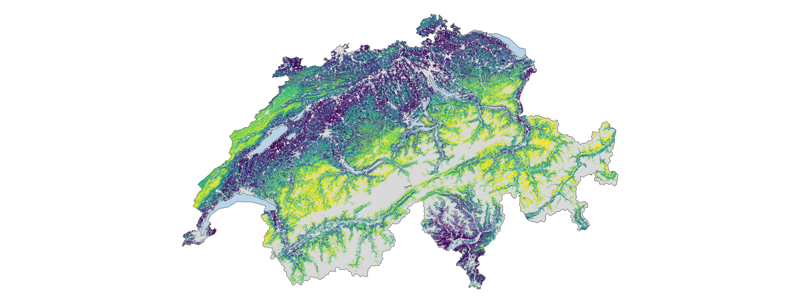

# **Modelling alpha diversity of Swiss vascular plants and bryophytes with a wide range of environmental predictors**

Author: Claudio W.  
Date: 30.06.2026

---

### Overview

This repository contains **scripts** for my bachelor thesis project in my Applied Digital Life Sciences study at Zürich University of Applied Sciences (ZHAW).  

In this project I modeled **vascular plant** and **bryophyte** **species richness** and **richness change** using data from the Swiss Biodiversity Monitoring (BDM) combined with a wide range of environmental predictors. The analysis used Random Forest models which captured complex relationships between predictors and response variables. It also allowed for the assessment of variable importance, the generation of partial dependence plots to visualize predictor effects and the creation of prediction maps of species richness across Switzerland in 100 m resolution.



---

### Modelling Approach

Several environmental predictors were considered for modelling species richness and richness change, including climate, topography, soil, land use, habitat, and landscape metrics. 
Variable selection was performed mainly on reasoning and expert knowledge from prior studies resulting in 20 predictors used in the final models.  

Random Forest models were used to model species richness and richness change because they are well suited to capturing complex relationships between predictors and response variables. Variable importance was assessed using permutation-based importance, expressed as the percent decrease in explained R². Partial dependence plots were created to illustrate key relationships, and spatial extrapolation was performed to generate prediction maps of species richness and richness change across Switzerland at 100 m resolution.

The entire report can be found in `00_report/`.

---

### Repository Structure
Generally the data and processing scripts are organized into a modular structure, with each folder corresponding to specific steps in the analysis pipeline. I first processed the raw BDM survey data, then downloaded and processed environmental geodata, extracted predictor values at BDM plot locations, and finally performed modelling and prediction.

Several modelling pipelines were made and __only__ the final attempt 3 is relevant for plotting, extrapolation and the final report. The files for the older attempts are not all present and or are not polished.

The data is stored outside of this repository in a separate `../data/` folder, which is __not__ tracked by Git and is available upon request. The `_config.r` file contains central path configurations that are sourced by all scripts to ensure consistent data access. 

The main folders and their contents are as follows:

```
data/ # Separate data repository (not tracked by Git)
BA-BDM-modeling/ # Main repository containing scripts and report
├── _config.r                    # Central path configuration (sourced by all scripts)
├── renv.lock                    # R package dependencies for reproducibility
├── README.md                    # This file
├── 01_bdm_processing/           # Process raw BDM survey data and calculate richness and richness change
│   ├── extract_coordinates_bdm.r
│   ├── preprocess_bryophytes.qmd
│   ├── preprocess_vascular.qmd
│   └── calculate_richness_slopes.r
├── 02_geodata_downloading/      # Empty since in final pipeline no downloading via scripts is needed
├── 03_geodata_processing/       # Rasterise, reproject, calculate and aggregate geodata
│   ├── aggregate_meteoswiss_*.r
│   ├── calculate_bioclim_sliding.r
│   ├── calculate_dem25.r
│   ├── calculate_twi_dem25.r
│   ├── rasterize_habitatmap_ch.r
│   ├── interpolate_kobo_soil.r
│   └── reproject_mowing_intensity_lv95.r
├── 04_geodata_extraction/       # Extract predictor values at BDM plot locations
│   ├── extract_bioclim_sliding.r
│   ├── extract_habitatmap_ch.r
│   ├── extract_meteoswiss.r
│   ├── extract_raster.r
│   └── raster_sources.csv # List of all raster sources to extract from in extract_raster.r
├── 05_modelling_processing/     # Preprocessing data for final modelling attempt
│   └── attempt_3_preprocessing.qmd
├── 06_modelling/                # Random Forest modelling (richness & change × moss & plants)
│   └── attempt_3_*              
├── 07_prediction/               # Switzerland-wide prediction at 100 m
│   └── predict_richness_ch.r
├── 08_plotting/                 # Plotting scripts and created figures for the report
│   ├── plots/
│   └── plotting_attempt_3_*.qmd
├── 00_report/                   # Quarto-based written thesis report
│   ├── index.qmd
│   ├── index.pdf
│   └── figures/
└── 00_hpc/                      # SLURM job scripts and results from HPC cluster computations
    ├── submit_*.sh
    └── slurm-*/
```

---

### Requirements

All analysis is written in **R**. Package dependencies are managed with `renv` (see `renv.lock`). Most files are basic scripts, while reports and exploratory notebooks use **Quarto** (`.qmd`).

Key packages: `ranger`, `caret`, `pdp`, `sf`, `terra`, `dplyr`, `ggplot2`, `patchwork`.

Computationally intensive steps (habitat rasterisation, crs-reprojection, national-scale prediction) were run on an HPC cluster via SLURM (scripts in `00_hpc/`).

---

### Reproducibility of the Analysis

Full reproduction requires access to the raw environmental data, created RF models, raw BDM survey data and processed outputs, which are available upon request, only scripts are provided here.  
1. With the data in place, packages can be restored via `renv::restore()`  
2. Paths adjusted in `_config.r`  
3. Scripts run sequentially from `01_bdm_processing/` through `08_plotting/`
